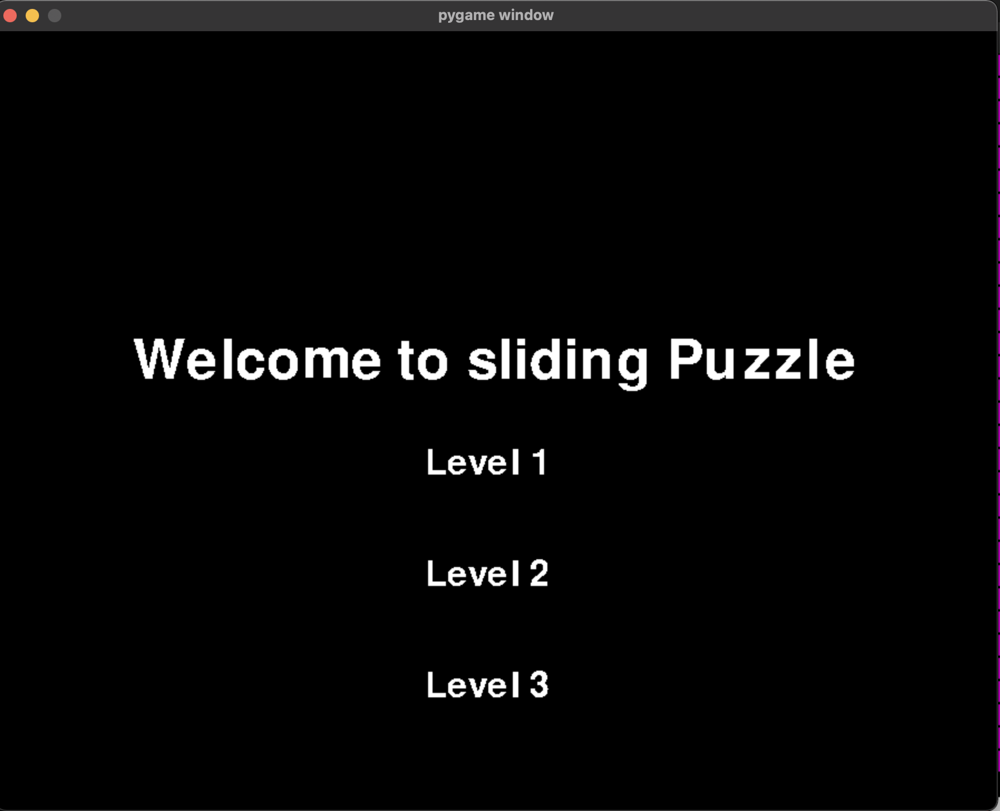
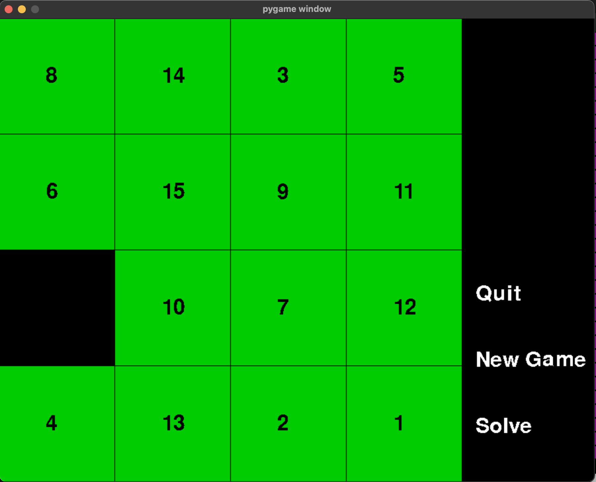

# Number Sliding Game

## About the Project
This number-sliding puzzle game is built on top of the Pygame library, offering an engaging and challenging experience for players. The game is designed around the classic sliding puzzle concept, where players rearrange numbered tiles within a grid to achieve a numerical order pattern.

Features:
1. Intuitive Gameplay: The game provides a straightforward yet challenging gameplay experience. Players can move tiles horizontally or vertically within the grid to rearrange them and solve the puzzle.

2. Variable Grid Sizes: Enjoy flexibility with different grid sizes, allowing players to choose the level of difficulty. Whether it's a 3x3 grid for beginners or a more challenging 5x5 grid for seasoned players, the game caters to various skill levels.

3. Randomized Puzzle Generation: Each new game session generates a randomized puzzle, ensuring a unique and dynamic experience every time. This feature adds an element of unpredictability, making the game both entertaining and replayable.

## Built With
* 

## Installations
1. Clone repo
```sh
git clone [URL]
```
2. Install pygame
```sh
pip install pygame
```
## Usage and App ScreenShots



## License
Distributed under the MIT License. See `LICENSE.txt` for more information.
